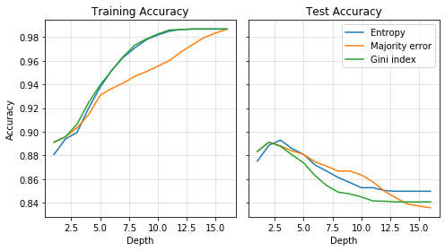
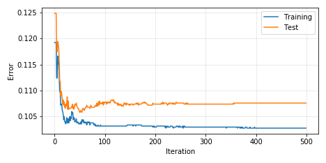
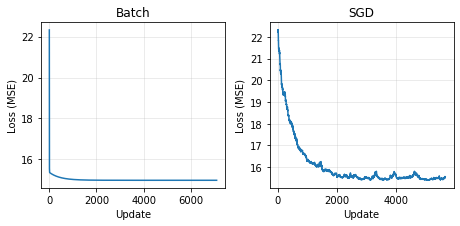
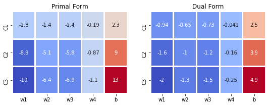
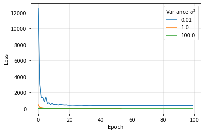
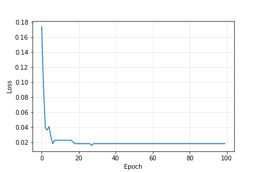

# Machine Learning

This is a light-weight machine learning library developed by Michael Sieverts for a machine learning course ([CS6350](http://www.cs.utah.edu/~zhe/teach/cs6350.html)) at the University of Utah.

At the top level there are folders for implementations of different machine learning algorithms. Abbreviated examples of the models can be called using the command line interface following this format:

```python
python examples.py -model decisiontree -value accuracy
```
-model: the model name as listed below

-value: the metric used either "accuracy" or "error"

## Decision Tree
```
python examples.py -m decisiontree
```

The DecisionTree class can be imported from decision_tree.py. This class allows the user to adjust the maximum depth of the tree, and select a function that computes the heuristics to create the tree. The heuristics available include entropy, majority error, and gini index. These heuristics are used to determine the best attribute to partition the data on. Decision trees are powerful models that can learn complex non-linear classifications. Below is a graph illustrating how accuracy varies with depth and heuristic functions on the bank dataset. 



In this example the training accuracy continually increases as depth increases, but the test accuracy begins decreasing after a depth of 3, and continues to decrease with more depth. The reduction in generalized accuracy is due to overfitting. Overfitting is a concern with decision trees because given enough attributes and no depth restriction the algorithm can learn to perfectly fit the training data. By learning this high amount of variance the model's generalization performance can suffer.


## Ensemble Learning

The ensemble learning folder contains implementations of Adaboost, Bagging, and Random Forest. All of these classes can be imported from ensemble_learning.py. These models combine many weak decision tree learners to create a more robust model that is less prone to overfitting. Even as the iteration increases and the models further fit the training data the test error holds nearly constant instead of increasing. Below is a graph of training and test error for Adaboost to illustrate that point. 



### Adaboost
```
python examples.py -m adaboost
```

The Adaboost class allows for the selection of a function that computes the heuristics to create the trees.

### Bagging
```
python examples.py -m bagging
```

The Bagging class allows the user to specify how many trees to create. When the model is fit it allows the user to specify how many samples to be included in the bootstrap sampling. 

### Random Forest
```
python examples.py -m randomforest
```

The Random Forest class allows the user to specify the number of trees to create, and the subset size that is used to select features to split on during tree creation.


## Linear Model
```
python examples.py -m linearregression
```

The LinearRegression class can be imported from linear_regression.py. This class allows the user to select whether to use batch or stochastic gradient descent while fitting to the trainig data. In this implementation of linear regression uses least mean squares to fit the data. Below is a graph illustrating the error with respect to the update. The batch gradient descent shows a quick smooth reduction in error, while the stochastic gradient descent has a more gradual noisy descent until it converges. 




## Perceptron
```
python examples.py -m perceptron
```

The Perceptron class can be imported from perceptron.py. This class allows the user to select which variant of perceptron to use. Available implementations include standard, voted, and averaged. Perceptron is a mistake driven algorithm meaning it updates whenever it misclassified an example. Below is an illustration of voted perceptron. The heatmap shows how the weights change with each epoch, and the line plot shows how many votes each weight combination recieves when it makes the final prediction. 


## Support Vector Machine
```
python examples.py -m svm
```

The support vector machine classes can be imported from svm.py. There are two classes available which import SVM in the primal and dual domains. SVM in the primal domain utilizes stochastic gradient descent to minimize the SVM loss. The dual form uses scipy to minimize the loss for the optimal solution. In the dual form both a linear and Gaussian kernel are available. Support vector machine learns a hyperplane that seperates the data while attempting to maximize the planes margin. Below is a comparison of weights learned by SVM in the primal and dual domain with various regularization values C.




## Logistic Regression
```
python examples.py -m logisticregression
```

The LogisticRegression class can be imported from logistic_regression.py. Either maximum likelihood (ML) or maximum a posteriori (MAP) can be selected as the objective function. Logistic regression is a probabalistic method that predicts a probability that an example belongs to a certain class. Below is an example of the training loss using MAP as the objective function with various values of variance for the prior.




## Neural Network
```
python examples.py -m ann
```

The ArtificialNeuralNet class can be imported from ann.py. This class implements a fully-connected neural network with an arbitrary depth and width. Below is a plot of training loss of a network with 2 hidden layers of size 10. 




