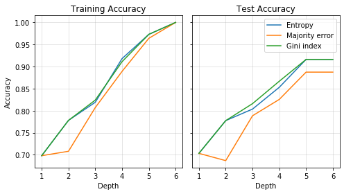

# ML_CS6350

This is a machine learning library developed by Michael Sieverts for CS6350 at the University of Utah

At the top level there are folders for implementations of different machine learning algorithms. Each folder contains a run.sh file to run examples. 

## Decision Tree

The DecisionTree class can be imported from decision_tree.py. This class allows the user to adjust the maximum depth of the tree, and select a function that computes the heuristics to create the tree. The heuristics available include entropy, majority error, and gini index.

## Ensemble Learning

The ensemble learning folder contains implementations of Adaboost, Bagging, and Random Forest. All of these classes can be imported from ensemble_learning.py

### Adaboost

The Adaboost class allows for the selection of a function that computes the heuristics to create the trees. 

### Bagging

The Bagging class allows the user to specify how many trees to create. When the model is fit it allows the user to specify how many samples to be included in the bootstrap sampling.

### Random Forest

The Random Forest class allows the user to specify the number of trees to create, and the subset size that is used to select features to split on during tree creation.

## Linear Model

The LinearRegression class can be imported from linear_regression.py. This class allows the user to select whether to use batch or stochastic gradient descent while fitting to the trainig data.

## Perceptron

The Perceptron class can be imported from perceptron.py. This class allows the user to select which variant of perceptron to use. Available implementations include standard, voted, and averaged. 

## Support Vector Machine

The support vector machine classes can be imported from svm.py. There are two classes available to import SVM in the primal and dual domains. SVM in the primal domain utilizes stochastic gradient descent to minimize the SVM loss. The dual form uses scipy to minimize the loss for the optimal solution. In the dual form both a linear and Gaussian kernel are available.

## Logistic Regression

The LogisticRegression class can be imported from logistic_regression.py. Either maximum likelihood (ML) or maximum a posteriori (MAP) can be selected as the objective function. 

## Neural Network

The ArtificialNeuralNet class can be imported from ann.py. This class implements a fully-connected neural network with an arbitrary depth and width. 
